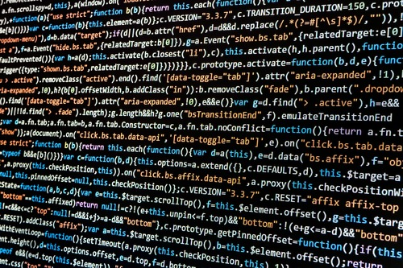

	<header class="major container 75%">
		<h2>We perform experiments,  
			do hacks,  
			and develop software,  
		which may or may not rip
		 
		the space-time continuum</h2>
	</header>

	

		<section class="feature left">
			
			

				<h3>Hackathons</h3>
				

					Our organisation has its roots in hackathons and we deeply enjoy building awesome software with a hard time-limit.
				

			

		</section>
		<section class="feature right">
			
			

				<h3>Software in D</h3>
				

					After a couple of successful hackathons, we started to develop professional software. We use a modern stack based on the power of D.
				

			

		</section>
		<section class="feature left">
			
			

				<h3>Data science in D</h3>
				

					Being students we never stop learning and experimenting. One of our favorite research areas is data science and we enjoy experimenting with new technologies.
				

			

		</section>
	

